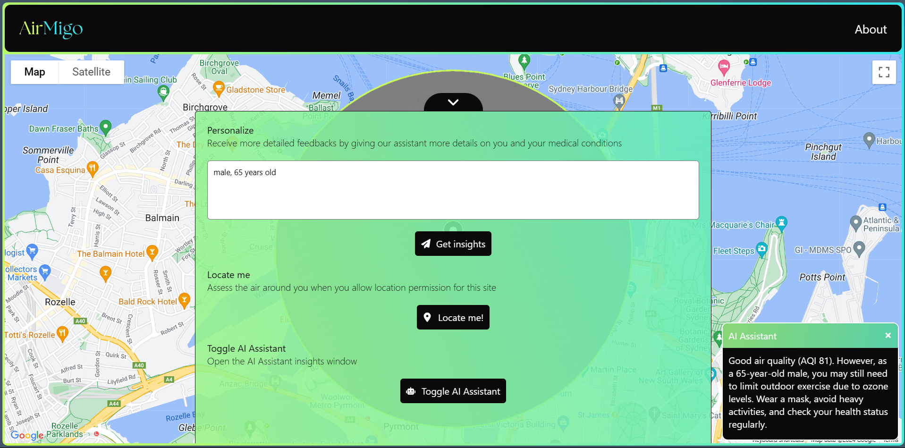

# AirMigo (Cal Hacks 11.0)
Helping respiratory patients with real-time AI-powered air quality monitoring for better health management

## Inspiration
Our inspiration came from the growing concern over air pollution and its detrimental effects on individuals with respiratory conditions like asthma and allergies. Most available AQI data only updates hourly, making it difficult for people to track real-time changes. We wanted to create a solution that provides real-time, personalized, and actionable alerts, helping individuals proactively manage their health and stay safe.

## What it does
The application collects real-time data from multiple sources, including traffic and air quality index (AQI) data. It analyzes the air quality in the user's surrounding area, visualizes the hotspots on the map, and provides real-time updates. Based on the user’s specific health conditions, such as asthma or allergies, the app sends personalized notifications with warnings and recommendations, helping users to take appropriate action to protect their health.

## How we built it
We first collect real-time data from multiple third-party APIs, including Google Maps API, to gather information such as traffic, air quality, and pollen levels. Then, we use SingleStore DB for low-latency queries, allowing to query and update data in real-time. We also use Groq API to call the Llama 3 model. With the metadata about the surroundings and user's health condition, the LLM model generate personalized notification messages. Last but not least, we use React for frontend and Node for backend.

## Challenges we ran into
- Data Integration: Collecting real-time data from multiple sources and ensuring consistent, accurate updates was quite a challenge.
- Familiarizing with SDKs: We spent considerable time getting familiar with the SingleStore SDK and Groq SDK.
- API Rate Limits: Handling rate limits from third-party APIs posed a challenge, especially for a real-time application that requires frequent updates.

## Accomplishments that we're proud of
- We successfully built a working product with core features, including real-time data updates, personalized LLM-generated messages, and map visualization for air quality hotspots.
- We also managed to achieved a moderately low-latency updates ( around 1s to send new updates to users).

## What we learned
- We learned a lot about the architecture behind real-time applications, particularly in handling large volumes of data and optimizing for low latency. In the future, we could explore using a Kafka queue to streamline real-time data even further.
- We gained insights into how AI models like Llama 3 can be used to generate personalized and meaningful notifications.

## What's Next for AirMigo
- We aim to expand the app’s capabilities to account for a wider range of health conditions, such as COPD, bronchitis, or heart conditions, to make the app more versatile.
- We plan to integrate additional real-time data sources, such as weather conditions, humidity levels, and wildfire smoke, to provide even more accurate real-time air quality reports.
- In case of having more resources (more API rates), we want to increase the geographical radius for data collection and allow for more frequent updates and larger coverage areas.

